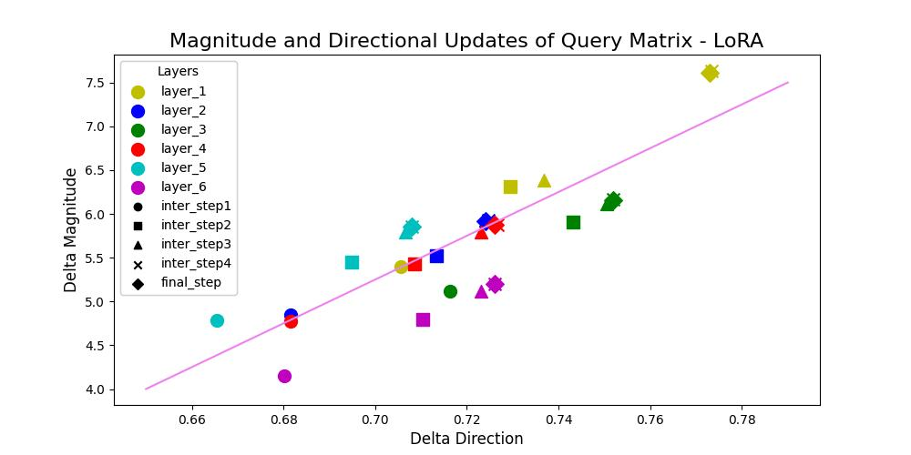
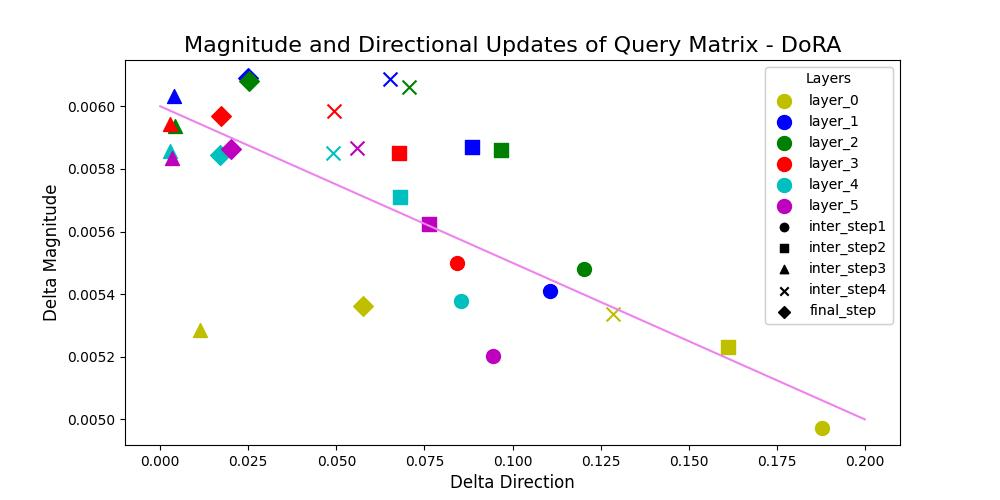

<h1 align="center">
    <p>DoRA: Weight-Decomposed Low-Rank Adaptation</p>
</h1>

<h1 align="center"> 
    
</h1>

## Reproducing the results in the paper

This repository has the code to reproduce results of Llama-2-7B for Cleaned Alpaca Instruction Dataset task specified in research paper
Checkpoints of LoRA and DoRA are stored at intermediate steps which are later used to visualize direction a
nd magnitude updates of query and value weight matrices

The official implementation of [DoRA](https://arxiv.org/abs/2402.09353) can be found [here](https://github.com/huggingface/peft/blob/main/src/peft/tuners/lora/layer.py) and is now fully supported by HuggingFace PEFT.

Research Paper - https://arxiv.org/abs/2402.09353

DoRA decomposes the pre-trained weight into two components, magnitude and direction, for fine-tuning, specifically employing LoRA for directional updates to efficiently minimize the number of trainable parameters. 
By employing DoRA, the learning capacity and training stability of LoRA can be enhanced while avoiding any additional inference overhead. DoRA consistently outperforms LoRA


### HuggingFace PEFT
DoRA is now supported by the Huggingface PEFT package. You can install the PEFT package using
```
pip install git+https://github.com/huggingface/peft.git -q
```

### DoRA hyperparameters settings
> While fine-tuning with DoRA by utilizing the configuration of LoRA can already achieve better results most of the time, achieving optimal performance compared to LoRA still requires adjustments to the hyperparameters. 

> Start with a slightly lower learning rate than that of LoRA, and users may also experiment with varying lora dropout ratios.

> Can also start with half of the rank of the LoRA configuration which oftentime can already results in comparable or even superior accuracy compared to that of LoRA.


## Visualizations of Magnitude and Directional Updates
<h2 align="center">
    <p>Query Weight Matrix - LoRA</p>
</h2>

<h2 align="center"> 
    
</h2>

<h2 align="center">
    <p>Value Weight Matrix - LoRA</p>
</h2>

<h2 align="center"> 
    
</h2>

<h2 align="center">
    <p>Query Weight Matrix - DoRA</p>
</h2>

<h2 align="center"> 
    
</h2>

<h2 align="center">
    <p>Value Weight Matrix - DoRA</p>
</h2>

<h2 align="center"> 
    
</h2>

